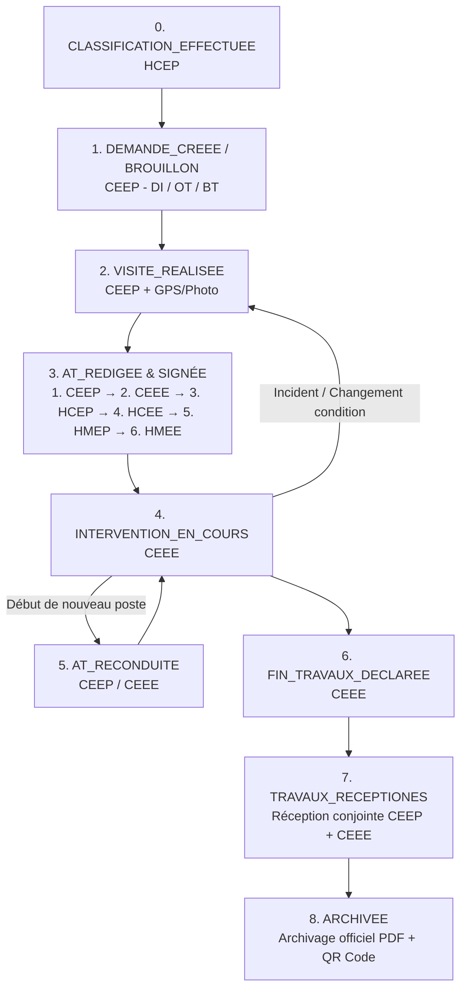

# OCP AT System - Système de Gestion des Autorisations de Travail


> Plateforme industrielle intégrée de gestion et de numérisation du cycle de vie complet des **Autorisations de Travail (AT)** et des **Permis Associés**, strictement conforme au **Standard OCP S-HSE-SEC-31 v1.0**.

---

## 📋 Table des Matières

- [Aperçu & Fonctionnalités Clés](#-aperçu--fonctionnalités-clés)
- [Stack Technique](#-stack-technique)
- [Architecture du Projet](#-architecture-du-projet)
- [Standard OCP S-HSE-SEC-31 & Chaîne de Signatures](#-standard-ocp-s-hse-sec-31--chaîne-de-signatures)
- [Prérequis](#-prérequis)
- [Installation & Démarrage](#-installation--démarrage)
  - [Option 1 : Démarrage Local (Recommandé & Rapide)](#option-1--démarrage-local-recommandé--rapide)
  - [Option 2 : Démarrage avec Docker Compose](#option-2--démarrage-avec-docker-compose)
- [Modules & Fonctionnalités](#-modules--fonctionnalités)
- [API REST Principale](#-api-rest-principale)
- [Comptes de Démonstration](#-comptes-de-démonstration)
- [Licence & Équipe](#-licence--équipe)

---

## 🌟 Aperçu & Fonctionnalités Clés

**OCP AT System** numérise de bout en bout la gestion des autorisations et permis de travail sur les sites industriels OCP :

1. **Cycle de Vie Complet Conforme au Standard OCP S-HSE-SEC-31** :
   - Création depuis les documents sources : **Demande d'Intervention (DI)**, **Ordre de Travail (OT)**, ou **Bon de Travail (BT)** avec numérotation automatique.
   - Classification des interventions (Niveau 1 sans AT / Niveau 2 avec AT obligatoire).
   - Visite préalable de chantier (§8.2) avec géolocalisation GPS et capture photo.
   - Analyse dynamique des risques, mesures de prévention, EPI et moyens d'accès.
   - Reconduction de poste (§8.4) et déclaration d'incidents / changements de conditions.
   - Réception conjointe des travaux (§8.5) avec contrôle des essais et remise en état.
   - Clôture et archivage sécurisé (§8.6) avec traçabilité minimale d'un an.

2. **Chaîne Séquentielle des Visas & Signatures Numériques** :
   - Signatures manuscrites tactiles intégrées avec horodatage, hachage cryptographique **SHA-256**, adresse IP et User-Agent pour conformité légale et audit trail.
   - Respect strict de l'ordre hiérarchique :
     $$\text{CEEP (1)} \longrightarrow \text{CEEE (2)} \longrightarrow \text{HCEP (3)} \longrightarrow \text{HCEE (4)} \longrightarrow \text{HMEP (5)} \longrightarrow \text{HMEE (6)}$$

3. **Assistant IA & Analyse Automatique des Permis (OCR)** :
   - Microservice dédié en Python FastAPI exploitant l'OCR et l'analyse documentaire pour la conformité automatique des permis requis (feu, espace confiné, fouille, hauteur, électrique).
   - Gating automatique empêchant la soumission si des permis obligatoires ne sont pas validés.

4. **Filtrage Intelligent & Ségrégation des Rôles** :
   - Confidentialité stricte des brouillons (visibles uniquement par le CEEP émetteur et l'Admin).
   - Affectation et visibilité contextuelle selon le périmètre de la Zone Propriétaire (P) et de la Zone Exécutante (E).
   - Recherche multicritère instantanée et filtres dynamiques par rôle.

5. **Système de Notifications Temps Réel** :
   - Notifications automatiques acheminées aux rôles concernés lors de chaque changement d'étape (signature, validation, refus, reconduction, incident, clôture).
   - Polling temps réel (30s) avec badge interactif dans la barre supérieure et navigation directe vers l'AT concernée.

6. **Génération PDF Officielle** :
   - Moteur de rendu haute fidélité (Apache FOP & PDFBox) produisant le formulaire officiel OCP 2 pages avec QR Code de vérification d'authenticité.

---

## 🛠 Stack Technique

### Backend (Spring Boot 3.4)
- **Langage** : Java 21 (Eclipse Temurin)
- **Framework** : Spring Boot 3.4.x (Web, Data JPA, Security, Validation)
- **Sécurité** : Spring Security 6 + JWT (JSON Web Tokens) + RBAC multi-rôles
- **Base de Données** : PostgreSQL 16 avec Flyway Migrations
- **Moteur PDF** : Apache FOP 2.9, Apache PDFBox 2.0, Apache XML Graphics Batik (SVG)
- **Mapping & DTOs** : MapStruct 1.5 & Lombok
- **Documentation API** : OpenAPI 3 / Swagger UI

### Microservice IA & OCR (FastAPI)
- **Langage** : Python 3.11
- **Framework** : FastAPI & Uvicorn
- **Traitement & OCR** : PyMuPDF (Fitz), Pillow, Tesseract OCR
- **Analyse Sémantique** : Intégration IA pour vérification de conformité des permis

### Frontend (React 19)
- **Framework** : React 19 + TypeScript 5
- **Build Tool** : Vite 6
- **UI Library** : Material UI (MUI v9) + Emotion
- **Navigation & Routage** : React Router v7
- **Gestion d'État** : Zustand
- **Signatures Numériques** : React Signature Canvas
- **Icônes & Thème** : Heroicons, Material Icons, Charte graphique officielle OCP Green (`#009A44`, `#1F4D3E`)

---

## 🏗 Architecture du Projet

```
ocp-at-system/
├── backend/                              # Backend Spring Boot (Java 21)
│   ├── src/main/java/com/ocp/at/
│   │   ├── controller/                   # Endpoints REST (AT, Visas, Permis, Notifications, Admin...)
│   │   ├── service/                      # Logique métier & orchestration de workflow
│   │   │   └── impl/                     # Implémentations (AutorisationTravail, Visa, Notification...)
│   │   ├── repository/                   # Repositories Spring Data JPA optimisés
│   │   ├── entity/                       # Entités JPA (AutorisationTravail, Visa, Notification, Zone...)
│   │   ├── security/                     # Filtres JWT, SecurityUtils, RoleUtils, ATContextService
│   │   ├── pdf/                          # Générateur PDF officiel Apache FOP / XSL-FO
│   │   └── mapper/                       # Mappers MapStruct
│   └── pom.xml
│
├── ai-service/                           # Microservice IA / OCR (Python FastAPI)
│   ├── app/
│   │   ├── main.py                       # Application FastAPI
│   │   ├── routes/                       # Endpoints d'analyse OCR des permis
│   │   └── services/                     # Analyse d'images et extraction de conformité
│   └── requirements.txt
│
├── frontend/                             # Frontend React 19 + TypeScript + Vite
│   ├── src/
│   │   ├── components/
│   │   │   ├── common/                   # FormulaireOCPInteractive, FormulaireOCPViewer, SignaturePad...
│   │   │   └── layout/                   # Topbar (avec polling notifs), Sidebar, Breadcrumbs...
│   │   ├── modules/
│   │   │   ├── autorisations/            # Liste, Détail, Formulaire, Signature CEEE, Actions de workflow
│   │   │   ├── visas/                    # Validation des visas HC & HM
│   │   │   ├── profile/                  # Profil utilisateur & NotificationsPage
│   │   │   ├── dashboard/                # Tableaux de bord personnalisés par rôle
│   │   │   └── administration/           # Gestion utilisateurs, rôles, permissions et référentiels
│   │   ├── services/                     # Clients Axios (AT, Visas, Notifications, Documents...)
│   │   ├── store/                        # Stores Zustand (AuthStore)
│   │   └── theme/                        # Thème OCP
│   └── package.json
│
├── docker-compose.yml                    # Déploiement multi-conteneurs
└── README.md
```

---

## 👥 Standard OCP S-HSE-SEC-31 & Chaîne de Signatures

### Rôles Métiers Définis

| Rôle | Désignation | Missions principales |
|---|---|---|
| **CEEP** | Chef d'Équipe Émetteur / Propriétaire (P) | Rédige l'AT, effectue la visite préalable, signe l'Étape 1, effectue la réception conjointe. |
| **CEEE** | Chef d'Équipe Exécutant (E) | Accuse réception de l'AT, signe l'Étape 2, démarre les travaux, déclare la fin des travaux. |
| **HCEP** | Hors Cadre Émetteur / Propriétaire (P) | Classifie les interventions, appose son visa (Étape 3), garant de la sécurité propriétaire. |
| **HCEE** | Hors Cadre Exécutant (E) | Appose son visa (Étape 4), garant de la sécurité exécutante et de l'archivage. |
| **HMEP** | Haute Maîtrise Émettrice / Propriétaire (P) | Garant terrain émetteur, appose son visa de garantie (Étape 5). |
| **HMEE** | Haute Maîtrise Exécutante (E) | Garant terrain exécutant, appose son visa de garantie (Étape 6). |
| **ADMIN** | Administrateur Système | Gestion des utilisateurs, rôles, services, zones et audits. |

### Diagramme des 9 Étapes du Workflow



---

## 📦 Prérequis

- **Java JDK** : Version 21 (Eclipse Temurin ou OpenJDK 21)
- **Maven** : Version 3.9+
- **Node.js** : Version 20+ avec **npm**
- **Python** : Version 3.10 ou 3.11 (pour le service IA)
- **PostgreSQL** : Version 15 ou 16

---

## 🚀 Installation & Démarrage

### Option 1 : Démarrage Local (Recommandé & Rapide)

#### 1. Démarrer la Base de Données PostgreSQL
Si vous n'avez pas PostgreSQL installé en local, vous pouvez lancer uniquement la base avec Docker en 2 secondes :
```bash
docker run --name postgres-ocp -e POSTGRES_DB=at_ocp_db -e POSTGRES_USER=postgres -e POSTGRES_PASSWORD=postgres -p 5432:5432 -d postgres:16-alpine
```

#### 2. Démarrer le Backend (Spring Boot)
Ouvrez un terminal :
```bash
cd backend
mvn spring-boot:run
```
- **API REST** : `http://localhost:8080/api`
- **Documentation Swagger UI** : `http://localhost:8080/swagger-ui.html`

#### 3. Démarrer le Frontend (React / Vite)
Ouvrez un second terminal :
```bash
cd frontend
npm install
npm run dev
```
- **Application Web** : `http://localhost:5173` (ou `http://localhost:3000`)

#### 4. Démarrer le Service IA (FastAPI - Optionnel)
Ouvrez un troisième terminal :
```bash
cd ai-service
# Créer et activer l'environnement virtuel
python -m venv venv
# Windows :
.\venv\Scripts\activate
# Linux/Mac :
source venv/bin/activate

pip install -r requirements.txt
uvicorn app.main:app --host 0.0.0.0 --port 8000 --reload
```
- **Service IA** : `http://localhost:8000`

---

### Option 2 : Démarrage avec Docker Compose

Pour démarrer l'ensemble des conteneurs (PostgreSQL + Backend + Frontend + Service IA) :

```bash
# Lancement en arrière-plan
docker-compose up -d

# Visualiser les logs
docker-compose logs -f
```

---

## 📦 Modules & Fonctionnalités

| Module | Description | Backend | Frontend |
|---|---|:---:|:---:|
| **Authentification & Sécurité** | Connexion JWT, gestion des sessions, refresh tokens et RBAC complet | ✅ | ✅ |
| **Formulaire Interactif OCP** | Formulaire officiel S-HSE-SEC-31 sections A à J avec auto-save | ✅ | ✅ |
| **Documents Sources** | Gestion et génération des Demandes d'Intervention (DI), OT et BT | ✅ | ✅ |
| **Visite Préalable** | Enregistrement terrain avec coordonnées GPS et photos | ✅ | ✅ |
| **Analyse des Risques & EPI** | Référentiels complets des risques OCP, mesures, EPI et moyens d'accès | ✅ | ✅ |
| **Vérification IA des Permis** | Analyse automatique OCR des permis scannés | ✅ | ✅ |
| **Chaîne des Visas & Signatures** | Signature manuscrite horodatée SHA-256 (CEEP $\rightarrow$ HMEE) | ✅ | ✅ |
| **Cycle de Vie & Transitions** | Démarrage, reconduction, signalement d'incident, fin de travaux | ✅ | ✅ |
| **Réception Conjointe** | Contrôle des essais, remise en état et clôture officielle | ✅ | ✅ |
| **Notifications Temps Réel** | Acheminement par rôle avec polling 30s et navigation directe | ✅ | ✅ |
| **Génération PDF & QR Code** | Exportation du formulaire officiel 2 pages avec QR Code d'authenticité | ✅ | ✅ |
| **Administration & Référentiels** | Gestion des utilisateurs, zones, services, installations et habilitations | ✅ | ✅ |

---

## 📡 API REST Principale

| Méthode | Endpoint | Description |
|---|---|---|
| `POST` | `/api/auth/login` | Authentification utilisateur et émission du token JWT |
| `GET` | `/api/auth/me` | Profil et permissions de l'utilisateur connecté |
| `GET` | `/api/autorisations-travail` | Liste paginée avec recherche (`search`) et filtre de statut (`statut`) |
| `POST` | `/api/autorisations-travail` | Création d'une nouvelle AT depuis un document source |
| `GET` | `/api/autorisations-travail/{id}` | Consultation détaillée de l'autorisation de travail |
| `PUT` | `/api/autorisations-travail/{id}/auto-save` | Sauvegarde automatique des sections du formulaire |
| `POST` | `/api/autorisations-travail/{id}/soumettre` | Soumission de l'AT avec validation des permis IA |
| `POST` | `/api/autorisations-travail/{id}/accuser-reception-ceee` | Accusé de réception par le Chef d'Équipe Exécutant |
| `POST` | `/api/visas/create-and-sign` | Création et signature d'un visa avec image manuscrite |
| `GET` | `/api/visas/autorisation/{atId}` | Liste chronologique des visas et signatures d'une AT |
| `POST` | `/api/autorisations-travail/{id}/demarrer` | Démarrage officiel des travaux sur site |
| `POST` | `/api/autorisations-travail/{id}/reconduire` | Reconduction de l'autorisation pour un nouveau poste |
| `POST` | `/api/autorisations-travail/{id}/declarer-fin` | Déclaration de fin d'intervention par le CEEE |
| `POST` | `/api/autorisations-travail/{id}/receptionner` | Validation conjointe de la réception des travaux |
| `GET` | `/api/pdf/at/{id}` | Téléchargement du formulaire officiel PDF certifié |
| `GET` | `/api/notifications` | Liste paginée des notifications de l'utilisateur |
| `GET` | `/api/notifications/count-unread` | Compteur instantané des notifications non lues |
| `PUT` | `/api/notifications/read-all` | Marquer toutes les notifications comme lues |

---

## 🔐 Comptes de Démonstration

Pour tester les différents rôles du workflow S-HSE-SEC-31 :

| Rôle | Email | Mot de passe | Périmètre |
|---|---|---|---|
| **Admin** | `admin@ocp.ma` | `Admin123!` | Accès complet système et gestion |
| **CEEP** | `ceep@ocp.ma` | `Password123!` | Émetteur / Propriétaire (Rédaction, Visite, Clôture) |
| **CEEE** | `ceee@ocp.ma` | `Password123!` | Exécutant (Accusé, Signature, Travaux, Fin) |
| **HCEP** | `hcep@ocp.ma` | `Password123!` | Hors Cadre Émetteur (Classification, Visa Étape 3) |
| **HCEE** | `hcee@ocp.ma` | `Password123!` | Hors Cadre Exécutant (Visa Étape 4, Archivage) |
| **HMEP** | `hmep@ocp.ma` | `Password123!` | Haute Maîtrise Émettrice (Garantie Visa Étape 5) |
| **HMEE** | `hmee@ocp.ma` | `Password123!` | Haute Maîtrise Exécutante (Garantie Visa Étape 6) |

---

## 📄 Licence & Équipe

Ce projet est sous licence propriétaire développé pour **OCP Group**.

<p align="center">
  <strong>OCP Group · Direction Sécurité & Santé au Travail (HSE)</strong><br/>
  Conforme à la directive <em>S-HSE-SEC-31</em>
</p>
